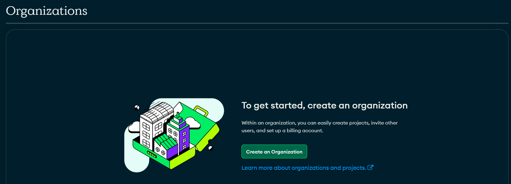
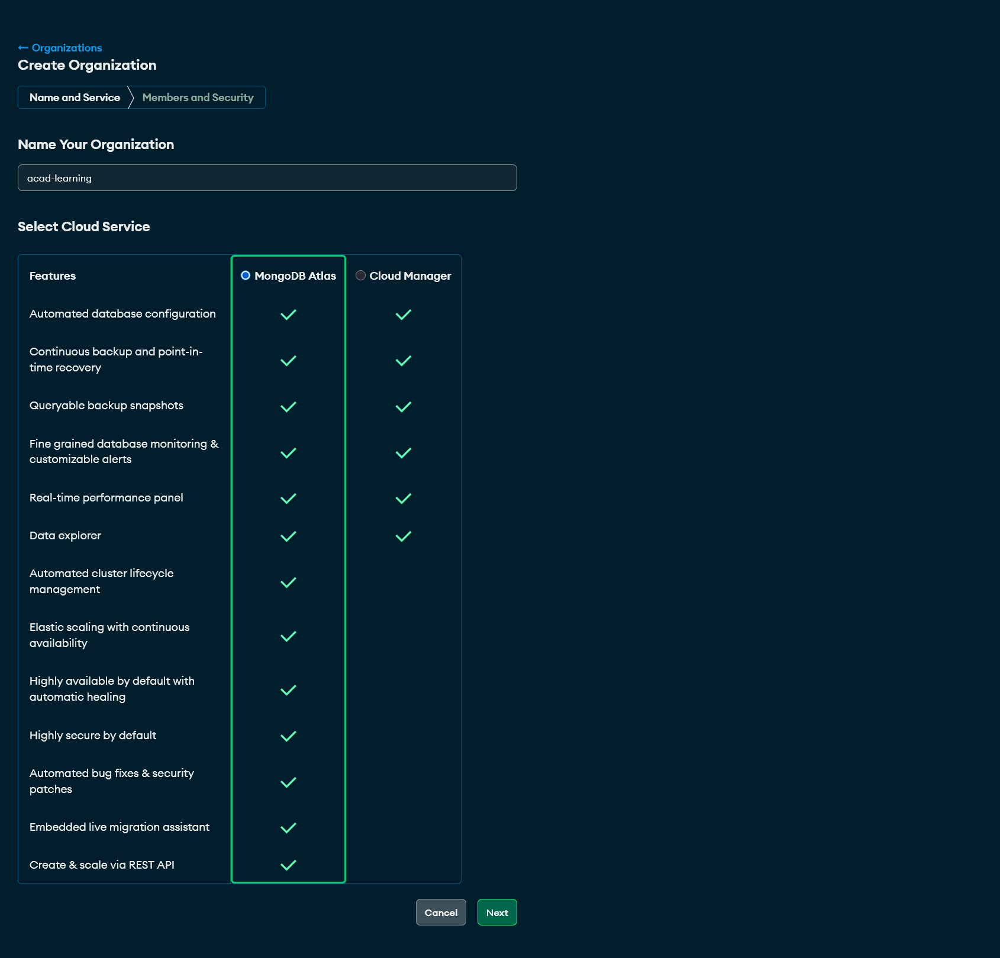
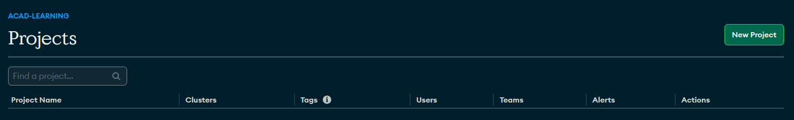
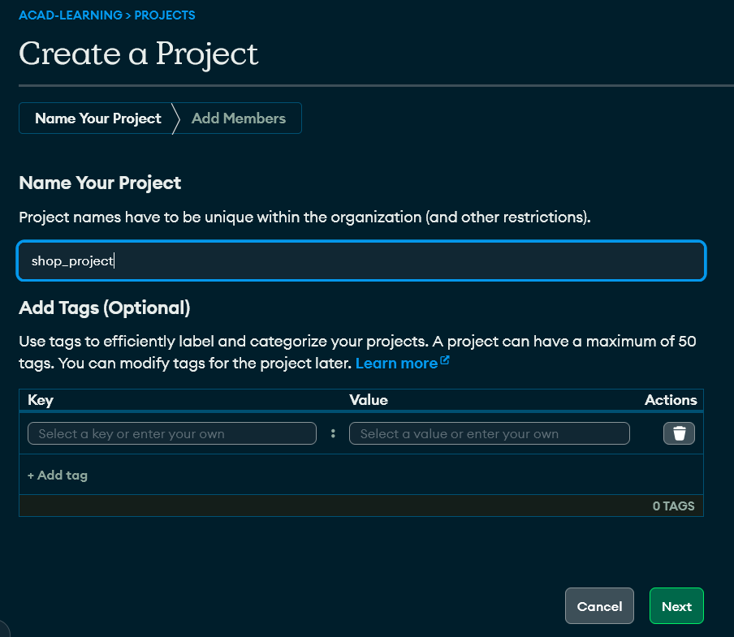
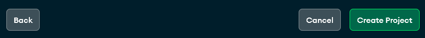
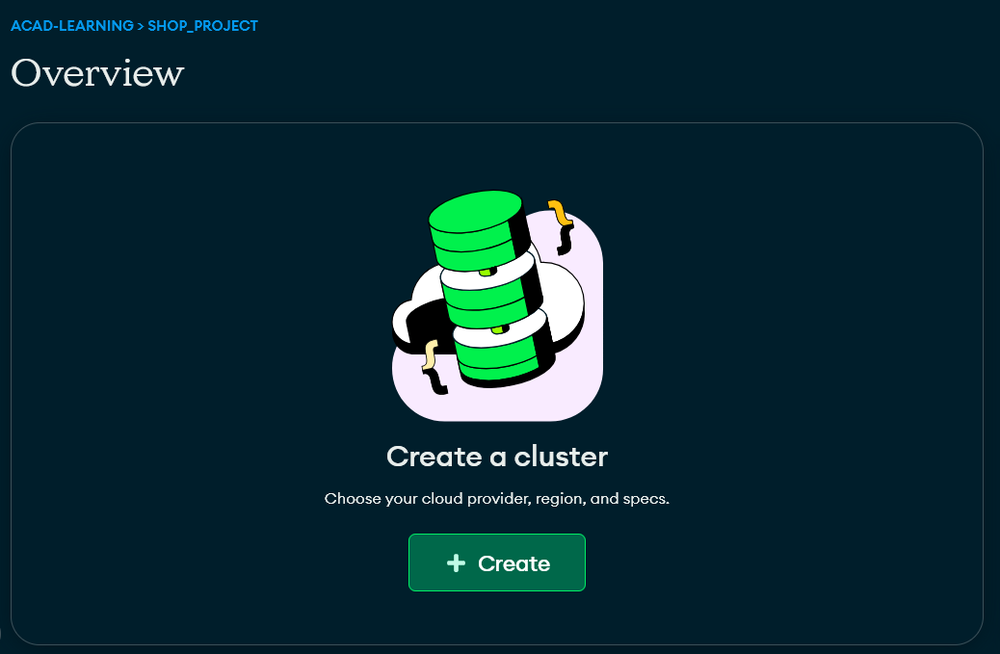
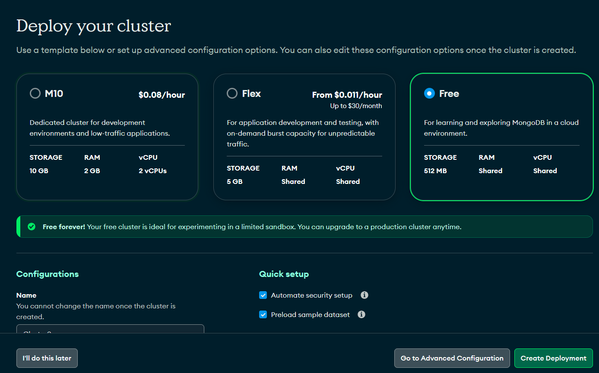
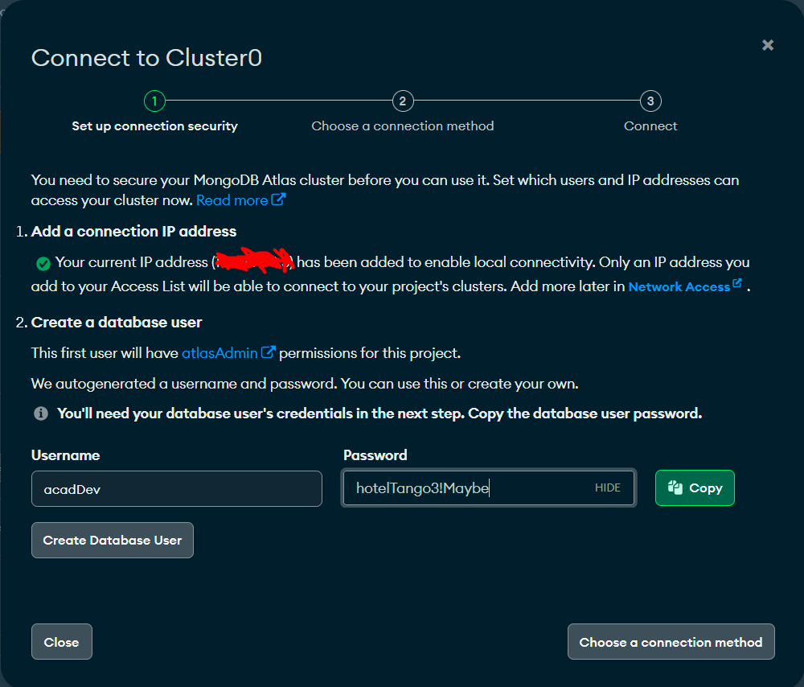

# NodeJS - The Complete Guide

> updated supplemental resource for configuring a new MongoDB Atlas cluster

## Getting Started

If you are setting up a brand new MongoDB Atlas cluster then after you sign up you should end up on a page like this.  Just click "Create an Organization" and continue to the next page.

### Creating an Organization

You can just give your organization any name and leave MongoDB Atlas selected, scroll down and click "Next"

On the next page, you don't need to change anything.  Just click "Create Organization"

This will create the organization and take you to the dashboard of projects.

### Creating A New Project

We need to create a new project next, so click "New Project"

On the next page, you will give your project a name.  Enter a suitable name for your project, and then click "Next"

Again, nothing to do on the next page, but click the "Create Project" button

Now we're back on the project overview page.

### Creating a Cluster

It's time to create our cluster (MongoDB server).  Click the "Create Cluster" button

Time to configure our cluster. On the configuration page, select "Free" for your cluster type.  None of the options in the page need otherwise changed.  You can click the "Create Deployment" button

You'll be back at your project overview dashboard after this, but with a modal that has popped up.  Note your current IP address has already been added to the allowed addresses to access this cluster.  You can change the username and password if you like, then click "Create Database User" (that will actually save the user in the Network Access settings).

You can click "Close" after that.  You database is set up and ready for connections (make sure you noted your username and password somewhere).
